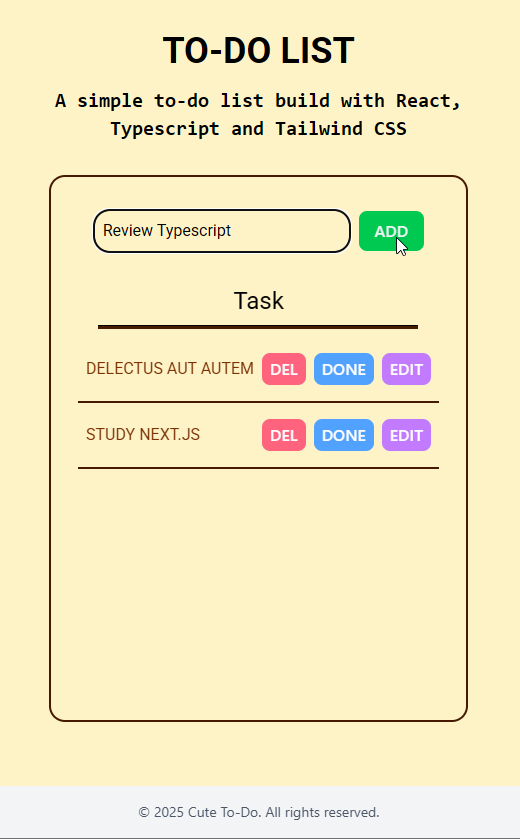

# react-todo-list

> A clean and user-friendly To-Do List application built using **React**, **TypeScript**, and **Tailwind CSS**.

## Table of contents

- [react-todo-list](#react-todo-list)
  - [Table of contents](#table-of-contents)
  - [General info](#general-info)
  - [Screenshots](#screenshots)
  - [Technologies](#technologies)
  - [Code Examples](#code-examples)
  - [Features](#features)
  - [To-do list](#to-do-list)
  - [Status](#status)
  - [Contact](#contact)

## General info

**React To-Do List** is a simple yet efficient task management app designed to help users stay organized.  
Built using **React**, **TypeScript**, and **Tailwind CSS**, it provides a clean interface with responsive design for both desktop and mobile use.  
Users can add, complete, and delete tasks with ease, making it a great starting point for learning state management in React.

## Screenshots



## Technologies

- React
- TypeScript
- Tailwind CSS
- Node.js
- Visual Studio Code

## Code Examples

```tsx
{
  list.map((task) => (
    <div
      key={task?.id}
      className="flex items-center justify-between border-b-2 border-amber-950 py-4 px-2"
    >
      <li
        className={`${task?.completed ? 'line-through opcity-50' : ''}font-lg font-roboto text-amber-900 uppercase`}
      >
        {task?.title}
      </li>
      <div className="flex">
        <Button
          onClick={() => handleDelete(String(task?.id))}
          style="btn-delete ml-2 md:ml-4"
          text="DEL"
        />
      </div>
    </div>
  ));
}
```

## Features

- Add new tasks to the list
- Edit tasks
- Mark tasks as Done
- Delete tasks

## To-do list

- Persistent data using local storage
- Integrate due dates and reminders

## Status

Project is: done

## Contact

By [boba-milktea](https://github.com/boba-milktea)
